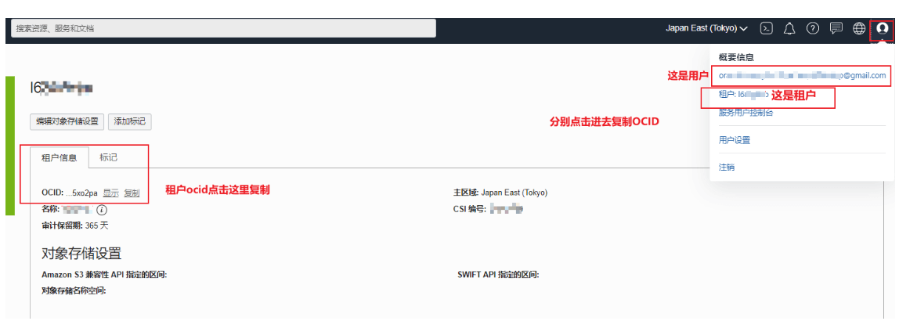
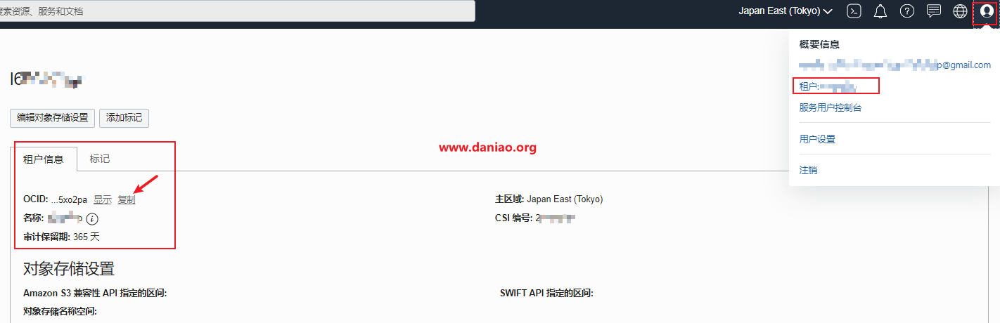
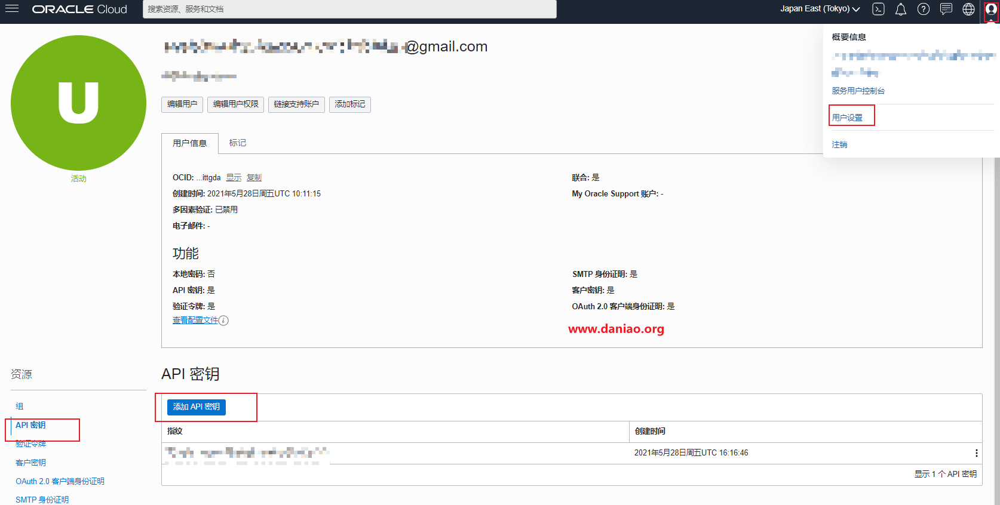
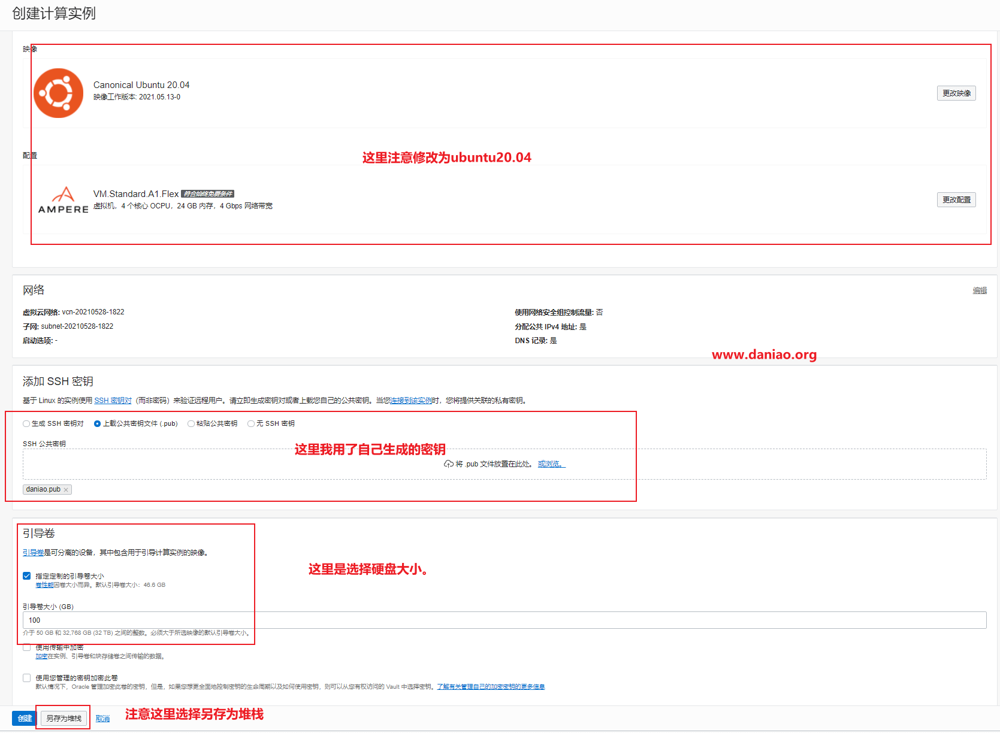
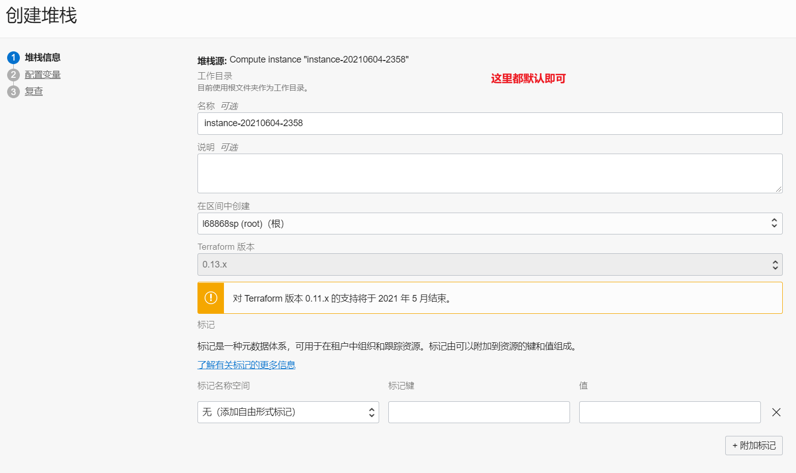
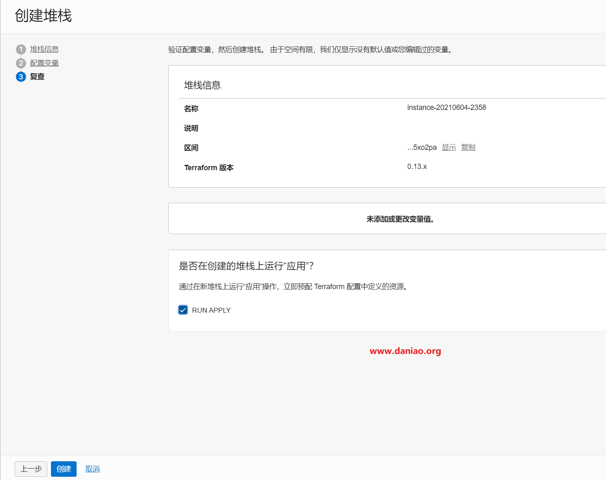
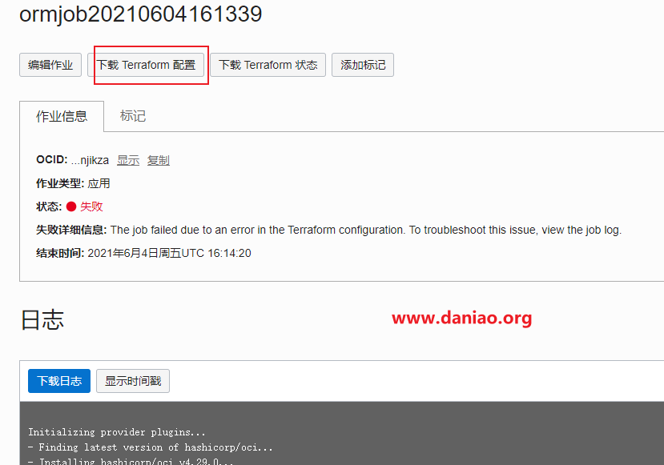

# oracle_arm
oracle arm registration script. 乌龟壳刷ARM脚本


# 本脚本优点

简单,主机配置好oci config，然后下载main.tf即可，不用自己解析各种参数,自动设置ssh登陆密码。

**20211108更新,参考oci api，脚本全部重写**

解决误报的问题.

oci请求几乎无延迟(为了保险起见加了5s的间隔，会自动判断请求返回值动态调整请求时间).

自动获取开机的**公网IP**，无需登陆后台即可ssh上🐔。

### TODO
- [ ] 低配置升级
- [ ] 无需下载公钥可刷
- [ ] 无需配置tf可刷
- [ ] 自动配置ipv6网络
- [x] 自动设置机器ssh密码

# 配置oci

## 安装oci

```shell
bash -c "$(curl –L https://raw.githubusercontent.com/oracle/oci-cli/master/scripts/install/install.sh)"
```
一路回车 然后 `exec -l $SHELL`重启shell 

使用 `oci -v`命令显示版本号则安装成功

## 配置oci

参考文章[大鸟博客-Oracle甲骨文 ARM VPS（VM.Standard.A1.Flex）自动抢购脚本代码](https://www.daniao.org/14035.html)中的 步骤 **3、复制租户和用户的ocid** 和 步骤 **4、配置cli** 配置好oci和公钥 

1.复制租户和用户的ocid
甲骨文后台右上角>>用户设置>>分别点击用户和租户，在信息栏中有我们需要的ID，分别点击复制，可以保存在记事本备份好。具体看图：



2.配置cli
输入如下代码开始配置，配置的路径默认在root目录。
`oci setup config`

具体配置看下面
```Enter a location for your config [/root/.oci/config]: 
Enter a user OCID: #输入你的用户ocid
Enter a tenancy OCID: #输入你租户的用户id
Enter a region by index or name(e.g.
1: ap-chiyoda-1, 2: ap-chuncheon-1, 3: ap-hyderabad-1, 4: ap-melbourne-1, 5: ap-mumbai-1,
6: ap-osaka-1, 7: ap-seoul-1, 8: ap-sydney-1, 9: ap-tokyo-1, 10: ca-montreal-1,
11: ca-toronto-1, 12: eu-amsterdam-1, 13: eu-frankfurt-1, 14: eu-zurich-1, 15: me-dubai-1,
16: me-jeddah-1, 17: sa-santiago-1, 18: sa-saopaulo-1, 19: uk-cardiff-1, 20: uk-gov-cardiff-1,
21: uk-gov-london-1, 22: uk-london-1, 23: us-ashburn-1, 24: us-gov-ashburn-1, 25: us-gov-chicago-1,
26: us-gov-phoenix-1, 27: us-langley-1, 28: us-luke-1, 29: us-phoenix-1, 30: us-sanjose-1): 9  #这里选择区域
Do you want to generate a new API Signing RSA key pair? (If you decline you will be asked to supply the path to an existing key.) [Y/n]: y  #输入y
Enter a directory for your keys to be created [/root/.oci]: 
Enter a name for your key [oci_api_key]: 
Public key written to: /root/.oci/oci_api_key_public.pem
Enter a passphrase for your private key (empty for no passphrase): 
Private key written to: /root/.oci/oci_api_key.pem
Fingerprint: 
Config written to /root/.oci/config
 
 
    If you haven't already uploaded your API Signing public key through the
    console, follow the instructions on the page linked below in the section
    'How to upload the public key':
 
   https://docs.cloud.oracle.com/Content/API/Concepts/apisigningkey.htm#How2
   ```
复制生成的公钥，获取命令如下
`cat /root/.oci/oci_api_key_public.pem`

把展示出来的内容复制下来。并且添加到，甲骨文后台=>用户设置>>资源>>API秘钥>>添加API秘钥，看图：

检查oci配置是否正确
`oci iam availability-domain list`

如果这样提示表示配置正确，如果不是，检查你前面的配置
```[root@host63c0dcac37 ~]# oci iam availability-domain list
{
"data": [
{
"compartment-id": "ocid1.tenancy.oc1..aaaaaaaauoxxxxxxxxxxxxx",
"id": "ocid1.availabilitydomain.oc1..aaaaaaaaaixxxxxxxxxxxxx",
"name": "uffff:AP-TOKYO-1-AD-1"
}
]
}
```

# 下载main.tf

参考文章[大鸟博客-Oracle甲骨文 ARM VPS自动抢购脚本 – 利用宝塔面板+oci](https://www.daniao.org/14121.html) 中的 步骤 **1、生成main.tf** 即可，下载到本地并解压出main.tf文件

1.新建实例，创建的时候我们选择ubuntu20即可。注意，引导卷这里选择下硬盘大小，推荐100G：

2.另存为堆栈，生产main.tf，这里默认即可：

3.配置变量，也是默认，复查，默认即可：

4.点击创建，默认会自动运行一次，我们点击下载 Terraform 配置，会得到一个压缩包，解压后，会有main.tf，用记事本打开，会有你需要的任何信息：


**注意**
创建实例的时候网络哪里不要动，默认就好！！！

然后密钥要提前下载好。

**补充**
很多老哥没有保存好密钥,不用担心，开机成功后按照下面的步骤设置密码即可


```
echo root:密码 |sudo chpasswd root
sudo sed -i 's/^#\?PermitRootLogin.*/PermitRootLogin yes/g' /etc/ssh/sshd_config;
sudo sed -i 's/^#\?PasswordAuthentication.*/PasswordAuthentication yes/g' /etc/ssh/sshd_config;
sudo service sshd restart
```

# 脚本需要修改的地方
## 启动 tg推送

修改oracle_arm.py文件：
```python
USE_TG = False  # 如果启用tg推送 要设置为True
TG_BOT_TOKEN = ''  # 通过 @BotFather 申请获得，示例：1077xxx4424:AAFjv0FcqxxxxxxgEMGfi22B4yh15R5uw
TG_USER_ID = ''  # 用户、群组或频道 ID，示例：129xxx206 ,
```
`USE_TG=True`
其他的token和id自行配置自己的,id可以点击这个[机器人](https://t.me/myidbot?start=botostore)获取

开始推送和创建成功的推送demo:


**最新版本成功的反馈（刚出新加坡的时候）**


**地狱春川**


<!-- 下面是旧版本


 -->

# 运行脚本

```
git clone https://github.com/kyleyh838/oracle_arm

cd oracle_arm

pip3 install -r requirements.txt
```
上传 `main.tf` 文件到 oracle_arm 目录

首先运行一遍测试一下
`python3 oracle_arm.py main.tf` 
稍等一下看返回结果,如果显示`抢注中，xxxxx` 就说明脚本没有问题，ctrl+c退出

开启脚本后台运行：
`nohup python3 oracle_arm.py main.tf >> /dev/null 2>&1 &`

如果想保存一个日志，可以运行下面这个命令:

`nohup python3 oracle_arm.py main.tf  > oracle_arm.log 2>&1 &`


会自动停止的,不用管了。Done and enjoy 🎉

# 再次感谢

感谢 [大鸟博客](https://www.daniao.org/) 最先放出刷ARM脚本,本脚本只是懒的解析参数并不想忍受oci terminal糟糕的响应速度不得已而写。


